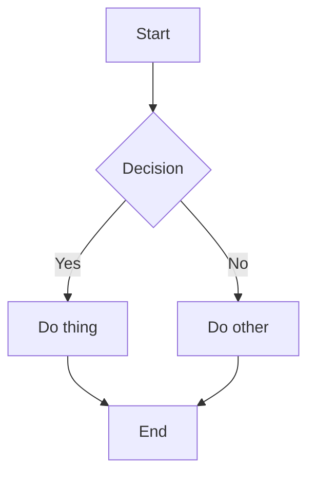

# Notes Blog (Jekyll + GitBook theme)

This repository hosts a Jekyll-based notes blog with a lightweight custom local theme inspired by GitBook.

Purpose: a place to collect learnings across software engineering topics, organized for easy browsing.

## Local development

Prerequisites:
- Ruby (2.7+ recommended) and Bundler installed.

Install dependencies and run the site locally:

```
bundle install
bundle exec jekyll serve
```

Then open http://localhost:4000 in your browser.

## Content structure

- `index.md` — Landing page.
- `SUMMARY.md` — Sidebar navigation map (GitBook style). Update this to control sidebar order.
- `_posts/` — Blog-style dated posts (optional).
- `notes/` — Main collection for evergreen notes, organized by topic subfolders.
  - `notes/philosophy/`
  - `notes/process/`
  - `notes/tools/`
  - `notes/effectiveness/`

You can add new notes under `notes/<topic>/your-note.md`. Each note can include front matter like:

```
---
layout: page
title: My Note Title
order: 10   # smaller appears higher in lists
tags: [topic-a, topic-b]  # optional; used to compute Related notes
---
```

Tags: add a `tags` array to any note to describe its themes. The note layout will automatically render a “Related notes” section by finding other notes that share at least one tag (up to 5 links). No need to hardcode related links inside note bodies.

## Deploying

If this repository is connected to GitHub Pages, enable Pages to build from the default branch. No external theme gem is required.

## Customization next steps (suggested)

- Tune `_config.yml` for title, description, and URLs.
- Refine `SUMMARY.md` and front matter `order` fields for better navigation.
- Add custom pages (About, Topics overview, etc.).
- Iterate on look and feel (colors, fonts, logo) using the theme options.


## Diagrams (Mermaid)

Mermaid diagrams are supported (client-side, like the original theme).

Usage in any note or post:

```

```

Notes:
- Enabled by default. To disable globally, set `mermaid: false` in `_config.yml`.
- Works with fenced code blocks labeled `mermaid`.
- Rendering occurs in the browser; the original code fence is replaced by a diagram at runtime.
